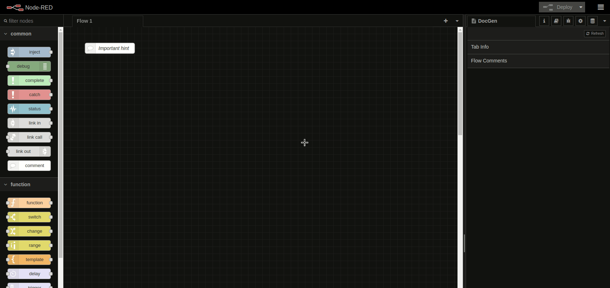
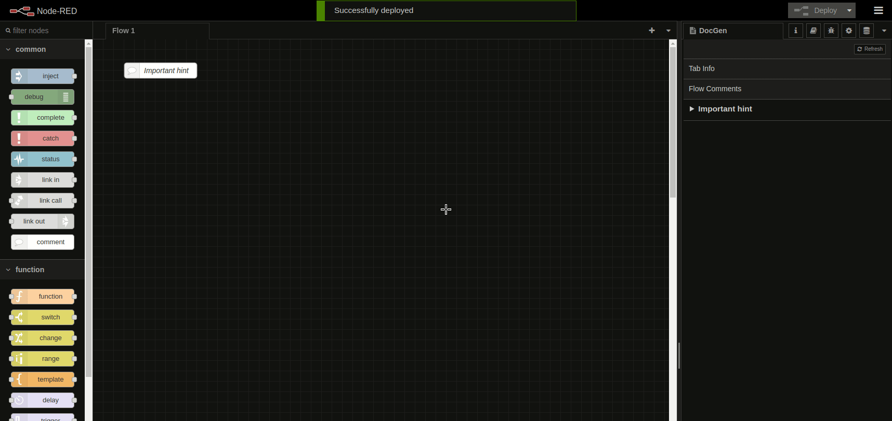

# Node Red documentation generation from comment nodes

## Generate documentation from your comments

This package is primarliy geared towards comment nodes. These will be read out during runtime and sent to the editor frontend.

## Generate documentation for your flows
